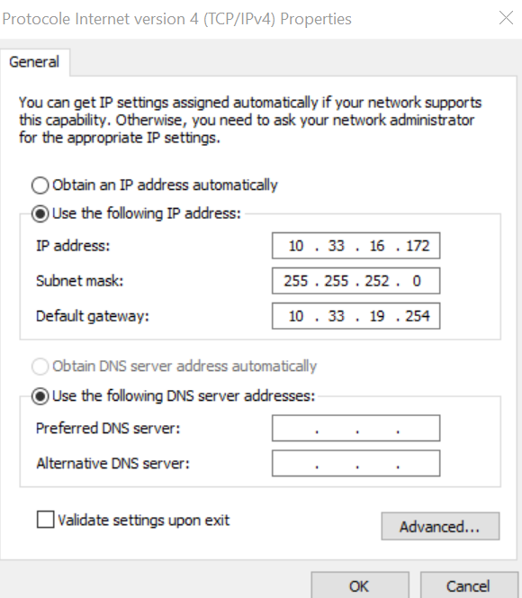

## I. Exploration locale en solo


1. Affichage d'informations sur la pile TCP/IP locale

-Name, MAC address and IP address of the WiFi interface

```
Description . . . . . . . . . . . : Intel(R) Dual Band Wireless-AC 8265
Physical Address. . . . . . . . . : 94-B8-6D-4B-8D-AE
IPv4 Address. . . . . . . . . . . : 10.33.16.171
```

-Name, MAC address and IP address of the Ethernet    interface

```
I don't have an ethernet card
```
-Display your gateway
```
Default Gateway . . . . . . . . . : 10.33.19.254
```
-Determine the MAC of the gateway

```
10.33.19.254          00-c0-e7-e0-04-4e     dynamic
```
-Find out how to display information on an IP map

```
IPv4 Address. . . . . . . . . . . : 10.33.16.171
Physical Address. . . . . . . . . : 94-B8-6D-4B-8D-AE
Default Gateway . . . . . . . . . : 10.33.19.254
```

2. Modifications des informations



```
By changing the IP address, the internet connection may not pass
```
## II. Exploration locale en duo

ipconfig 
1.   Adresse IPv4. . . . . . . . . . . . . .: 10.10.10.16
2.   Masque de sous-réseau. . . . . . . . . : 255.255.255.0


Deux machine qui se joignent :Ping 10.10.10.15
Envoi d’une requête 'Ping'  10.10.10.15 avec 32 octets de données :
Réponse de 10.10.10.15 : octets=32 temps=1 ms TTL=128
Réponse de 10.10.10.15 : octets=32 temps=1 ms TTL=128
Réponse de 10.10.10.15 : octets=32 temps=1 ms TTL=128
Réponse de 10.10.10.15 : octets=32 temps=1 ms TTL=128

Statistiques Ping pour 10.10.10.15:
    Paquets : envoyés = 4, reçus = 4, perdus = 0 (perte 0%),
Durée approximative des boucles en millisecondes :
    Minimum = 1ms, Maximum = 1ms, Moyenne = 1ms


Déterminer l'adresse MAC de votre correspondant
Interface : 10.10.10.16 --- 0x8
  Adresse Internet      Adresse physique      Type
  10.10.10.15           50-eb-f6-e4-41-70     dynamique


Tester l'accès internet :(ping 1.1.1.1)
Envoi d’une requête 'Ping'  1.1.1.1 avec 32 octets de données :
Réponse de 1.1.1.1 : octets=32 temps=20 ms TTL=55
Réponse de 1.1.1.1 : octets=32 temps=20 ms TTL=55
Réponse de 1.1.1.1 : octets=32 temps=22 ms TTL=55
Réponse de 1.1.1.1 : octets=32 temps=20 ms TTL=55

Statistiques Ping pour 1.1.1.1:
    Paquets : envoyés = 4, reçus = 4, perdus = 0 (perte 0%),
Durée approximative des boucles en millisecondes :
    Minimum = 20ms, Maximum = 22ms, Moyenne = 20ms